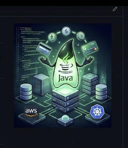

# Hi, I'm Michelle 👋

Backend Engineer with 6+ years of experience building scalable and high-availability systems for fintech, payments, enterprise platforms, and high-volume transactional environments.

## Core Expertise

- Java
- Kotlin
- Spring Boot
- REST APIs
- Microservices
- Distributed Systems
- Event-Driven Architecture
- AWS Cloud

## Industry Experience

- Fintech
- Payment Processing
- ERP Systems
- Financial Operations
- Enterprise Platforms

## Current Focus

- Backend Engineering
- Cloud-Native Architectures
- Distributed Systems
- Performance Optimization
- AI-Assisted Development

## Connect with me

---

Currently working on backend solutions focused on scalability, reliability, cloud-native architectures, and modern software engineering.
